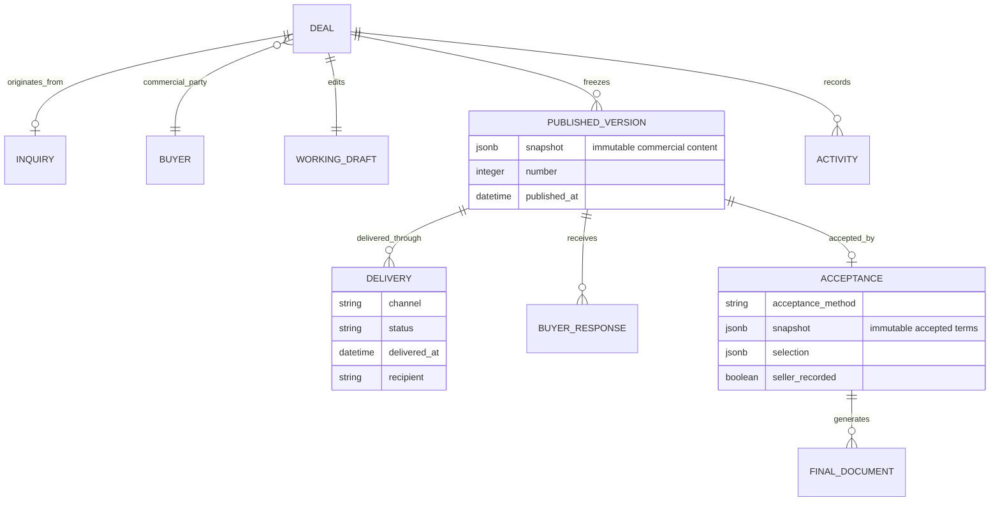

# Deal business objects

The Rails `Quote` model remains the persistence root for compatibility but is presented as Deal. `QuoteRevision` is the Published Version. `VersionDelivery`, `DealResponse` and `QuoteAcceptance` deliberately reference that immutable Version. Working-draft edits never mutate a Published Version or Acceptance snapshot.
