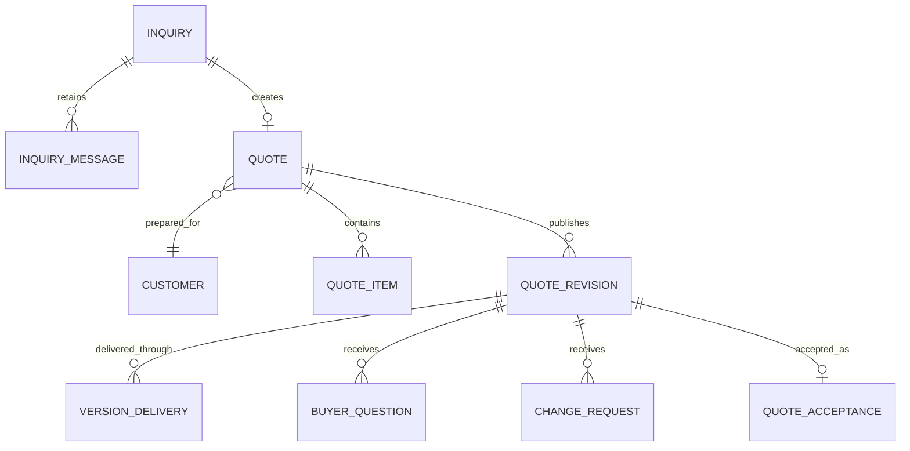

# Quote business objects

`Quote` is the editable commercial aggregate. `QuoteRevision` is the immutable Published Version used by the customer page, PDF and Excel. Customer questions and requested changes always reference the Version the buyer saw. Applying a structured change updates the working Quote and creates no historical mutation; a later publish creates the next Version.

Legacy Deal naming is compatibility-only in older controllers and persistence associations.
