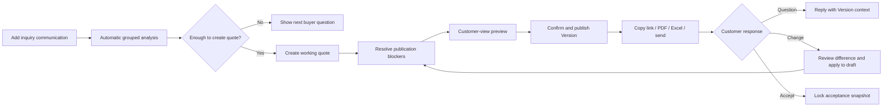

# Quote lifecycle and next action

`QuoteLifecycle` supplies shared state and next action for Quote list and detail. `QuoteReadinessAudit` is the single publication gate. Viewed, delivered, expired and awaiting deposit are signals rather than separate workspaces.
