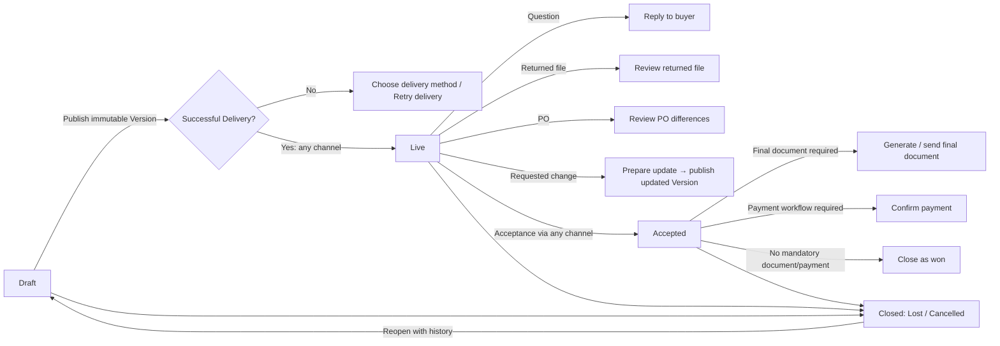

# Deal stages and Next action

`DealProgress` is the single derivation point used by Inbox, Deals and Deal Overview. Viewed, Delivered, Expired, PO received, PI generated and payment received remain conditions or activities rather than user-visible top-level stages.
